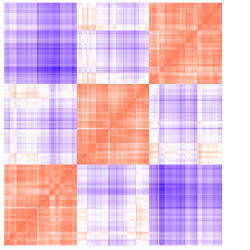
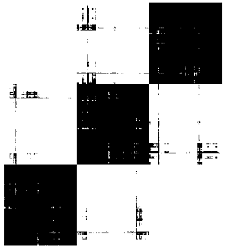

## VAT Analysis Demo
This package aims to build a robust AI-Model which will be robust against 

By creating three bubble of random datapoints with different "Standard Deviation", 
we will be able to measure clustering algorithm performance by VAT analysis.

#### std=0.3
clustering outcome:

VAT analysis:

Binarized VAT:

img[alt=gg] { width: 200px; }

#### std=0.6
clustering outcome:

VAT analysis:

Binarized VAT:

#### std=0.8
clustering outcome:

VAT analysis:

Binarized VAT:

